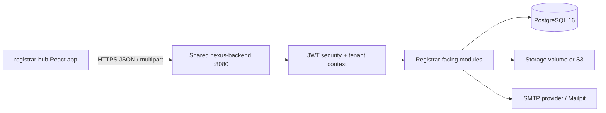
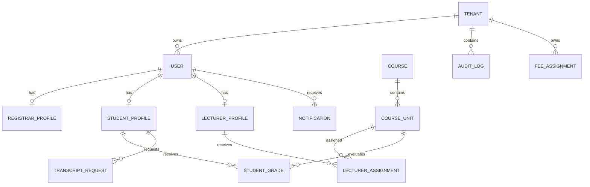
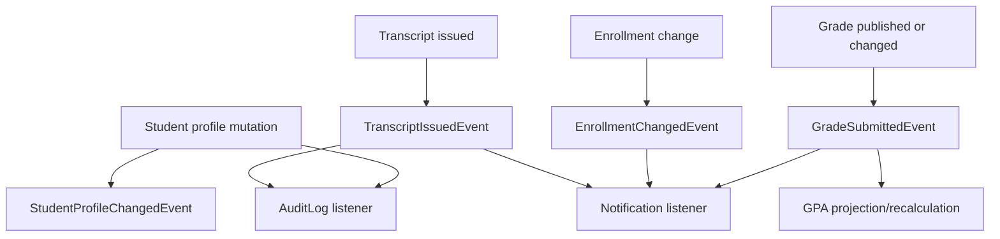

# Registrar Hub Backend Specification

## 1. Purpose

This document defines the Spring Boot and Java backend required by the `registrar-hub` frontend. It is based on the frontend source under `src/`, including route composition, API calls, request payloads, TypeScript types, local-storage contracts, page workflows, and the shared UI components.

The backend must be implemented as a module of the shared Nexus University backend, not as a second registrar-only database or application. The registrar frontend is one client of the platform API.

## 2. Current Frontend Findings

### 2.1 Frontend application

- React 18 + TypeScript + Vite.
- React Router routes: `/`, `/auth`, `/dashboard`, `/students`, `/lecturers`, `/courses`, `/fees`, `/results`, `/transcripts`, `/reports`, `/notifications`, `/tools`, `/settings`, `/help-support`.
- API calls are centralized in `src/lib/api.ts` except for no direct feature-level `fetch` calls.
- The Vite development proxy maps `/api` to `http://localhost:8080`.
- The API helper currently defaults to `http://localhost:8000`, which is obsolete and must be changed to `http://localhost:8080` or a configured `VITE_API_BASE_URL`.
- Every current path is appended as `${BASE}/api${path}` and most paths contain a trailing slash.
- The frontend currently stores a token but does not send it. The backend must not rely on this client-side check. The frontend must add `Authorization: Bearer <access_token>` to every authenticated request.

### 2.2 Authentication storage contract

Current browser keys:

| Key                       | Meaning                                   | Backend source                            |
| ------------------------- | ----------------------------------------- | ----------------------------------------- |
| `access_token`            | Access JWT                                | `POST /auth/login/`                       |
| `user_id`                 | Authenticated user ID                     | login response `user.uid`                 |
| `user_email`              | Authenticated email                       | login response `user.email`               |
| `registrar_college`       | Cached registrar college                  | registrar profile/login response          |
| `registrar_authenticated` | Checked by landing page but never written | Remove or replace with server-backed auth |

The backend must treat the JWT, not any local-storage value, as authoritative. The `user_id` and `registrar_college` values are display/cache values only and must not be trusted for authorization.

### 2.3 Frontend files reviewed

#### Application and routing

- `src/main.tsx`
- `src/App.tsx`
- `src/App.css`
- `src/index.css`
- `src/vite-env.d.ts`

#### Pages

- `src/pages/Index.tsx`
- `src/pages/Auth.tsx`
- `src/pages/Dashboard.tsx`
- `src/pages/Students.tsx`
- `src/pages/Lecturers.tsx`
- `src/pages/Courses.tsx`
- `src/pages/Fees.tsx`
- `src/pages/Results.tsx`
- `src/pages/Transcripts.tsx`
- `src/pages/Reports.tsx`
- `src/pages/Notifications.tsx`
- `src/pages/Calendar.tsx`
- `src/pages/Tools.tsx`
- `src/pages/Settings.tsx`
- `src/pages/HelpSupport.tsx`
- `src/pages/NotFound.tsx`

#### Domain types, hooks, and utilities

- `src/types/student.ts`
- `src/types/lecturer.ts`
- `src/types/course.ts`
- `src/types/fee.ts`
- `src/types/notification.ts`
- `src/types/activity.ts`
- `src/hooks/useBranding.ts`
- `src/hooks/useNotifications.ts`
- `src/hooks/use-mobile.tsx`
- `src/hooks/use-toast.ts`
- `src/lib/api.ts`
- `src/lib/studentMigration.ts`
- `src/lib/utils.ts`

#### Feature components

- `src/components/layout/DashboardLayout.tsx`
- `src/components/layout/Sidebar.tsx`
- `src/components/dashboard/StatCard.tsx`
- `src/components/students/StudentTable.tsx`
- `src/components/students/StudentFormModal.tsx`
- `src/components/students/StudentViewModal.tsx`
- `src/components/students/DeleteConfirmModal.tsx`
- `src/components/lecturers/LecturerTable.tsx`
- `src/components/lecturers/LecturerFormModal.tsx`
- `src/components/lecturers/LecturerViewModal.tsx`
- `src/components/lecturers/AssignCourseUnitsModal.tsx`
- `src/components/NavLink.tsx`

#### Shared UI components

All files under `src/components/ui/` were reviewed. They are presentation and interaction primitives from Radix/shadcn-style components. They do not own persistence or define additional backend contracts. The backend-relevant behavior exposed through them is form input, selection, modal confirmation, file selection, loading state, and toast error display.

## 3. Recommended Deployment Architecture

Use one shared Spring Boot 3.3+/3.5 application running on Java 21, with PostgreSQL 16 and Flyway. The registrar frontend communicates with it over HTTPS.



The following existing skeleton must not become a separate production backend:

- `registrar-hub/REG-Backend`

Its dependency choices can be reused, but its port `8082` and `ddl-auto: update` approach must be discarded. The shared backend owns all registrar data and all database migrations.

## 4. Spring Package Structure

```text
com.nexus.platform/
├── NexusApplication.java
├── shared/
│   ├── security/       JWT, current user, role guards
│   ├── tenancy/        TenantContext and tenant filter
│   ├── web/            CORS, aliases, pagination, error responses
│   ├── exception/      RFC 7807 errors with error and detail fields
│   └── audit/          transaction and request metadata
├── identity/
│   ├── api/            login, OTP, password reset DTOs
│   └── internal/       User, RefreshToken, OtpVerification
├── tenant/
│   ├── api/            branding DTOs
│   └── internal/       Tenant, BrandingSettings
├── registrar/
│   ├── api/            registrar account and administrator endpoints
│   └── internal/       RegistrarProfile
├── people/
│   ├── api/            student and lecturer profile endpoints
│   └── internal/       Profile, StudentRecord, LecturerProfile
├── academic/
│   ├── api/            courses, course units, calendar, assignments
│   └── internal/       Course, CourseUnit, AcademicEvent, LecturerAssignment
├── finance/
│   ├── api/            fee assignment endpoints
│   └── internal/       FeeAssignment
├── records/
│   ├── api/            student grades, GPA, transcripts
│   └── internal/       StudentGrade, GradingScale, Transcript
├── reporting/
│   ├── api/            dashboard and report endpoints
│   └── internal/       SQL projections and CSV/PDF exporters
├── notification/
│   ├── api/            notification query and mutation endpoints
│   └── internal/       Notification and event listeners
├── auditlog/
│   ├── api/            activity feed
│   └── internal/       AuditLog
└── storage/
    ├── api/            upload and file streaming endpoints
    └── internal/       StoragePort, LocalStorage, S3Storage
```

Use Spring Modulith boundaries. Controllers expose DTOs only; JPA entities must never be serialized directly.

## 5. Security and Authorization

### 5.1 Roles

At minimum:

```java
public enum Role {
    REGISTRAR,
    ADMIN,
    STUDENT,
    LECTURER
}
```

Registrar self-registration must not create a privileged account. A registrar is created by an existing administrator, tenant provisioning, or a signed invitation flow. The current public registration form is a legacy UI path and should be removed or changed to invitation acceptance.

### 5.2 JWT requirements

- Login returns an access token and, preferably, a refresh token.
- All protected requests require `Authorization: Bearer <token>`.
- Access token claims should include `sub`, `tenant_id`, `role`, `email`, `iat`, and `exp`.
- Never infer role from email domain.
- Revoke refresh-token families on logout or suspected compromise.
- Return `401` for missing/invalid/expired credentials and `403` for valid users without permission.
- Add a frontend interceptor before enabling protected production routes.

### 5.3 Registrar permissions

| Operation                       |  REGISTRAR |  ADMIN | STUDENT/LECTURER |
| ------------------------------- | ---------: | -----: | ---------------: |
| Read own registrar account      |        yes |    yes |               no |
| Read student/lecturer directory |        yes |    yes |               no |
| Create/update/delete people     |        yes |    yes |               no |
| Manage courses and units        |        yes |    yes |               no |
| Manage fees                     |        yes |    yes |               no |
| Edit grades                     |        yes |    yes |               no |
| Generate transcripts/reports    |        yes |    yes |               no |
| Manage notifications            | own/tenant | tenant |         own only |
| Edit tenant branding            |  delegated |    yes |               no |
| Read audit activities           |        yes |    yes |               no |

Every authorization decision must use the authenticated principal and tenant context. Do not authorize using `user_id`, `college`, or IDs supplied only in request bodies.

## 6. API Transport Contract

### 6.1 Base URLs

Canonical routes:

```text
http://localhost:8080/api/v1/...
https://api.example.edu/api/v1/...
```

During frontend migration, register compatibility aliases under `/api/...` and accept both trailing-slash and non-trailing-slash forms. Remove aliases after the frontend has migrated.

Recommended frontend change:

```text
VITE_API_BASE_URL=http://localhost:8080
request path=/api/v1/{resource}
```

### 6.2 Headers

JSON requests:

```http
Content-Type: application/json
Authorization: Bearer eyJ...
```

Multipart requests must not manually set `Content-Type`; the browser must add the boundary.

### 6.3 Errors

Return `application/problem+json` with both `error` and `detail` because current frontend error handlers read either key.

```json
{
  "type": "https://api.example.edu/problems/validation",
  "title": "Validation failed",
  "status": 422,
  "error": "Validation failed",
  "detail": "One or more fields are invalid.",
  "fieldErrors": {
    "email": "Must be a valid email address"
  },
  "traceId": "..."
}
```

Use status codes consistently:

- `400` malformed request
- `401` unauthenticated
- `403` unauthorized
- `404` missing resource
- `409` duplicate/conflict
- `422` field validation failure
- `429` rate limit
- `500` unexpected server error without stack trace

### 6.4 Response and ID rules

- Preserve the current snake_case field names for existing registrar calls.
- Serialize opaque IDs as strings to avoid JavaScript precision and type inconsistencies.
- Return arrays for compatibility when no pagination parameters are supplied.
- Add `{content, page, size, totalElements, totalPages}` when pagination is explicitly requested.
- Preserve partial update semantics for existing `PUT` calls.

## 7. Endpoint Specification

The following endpoints are directly exercised by the current frontend.

### 7.1 Health

```http
GET /api/health/
```

Anonymous response:

```json
{ "status": "ok", "service": "nexus-backend" }
```

Also expose Actuator health internally and use it for deployment checks.

### 7.2 Authentication and password reset

#### Login

```http
POST /api/v1/auth/login/
```

Request:

```json
{ "identifier": "registrar@example.edu", "password": "secret" }
```

`identifier` may be an email. The platform may also support student/registration numbers for the shared LMS, but registrar login should resolve to a real user and persisted role.

Response consumed by `Auth.tsx`:

```json
{
  "token": "jwt-access-token",
  "refresh_token": "refresh-token",
  "user": {
    "uid": "user-id",
    "email": "registrar@example.edu",
    "displayName": "Jane Registrar"
  },
  "profile": {
    "id": "profile-id",
    "email": "registrar@example.edu",
    "full_name": "Jane Registrar",
    "role": "registrar",
    "employee_id": "REG-001",
    "department": "Academic Affairs",
    "college": "Nexus University"
  }
}
```

#### Logout

```http
POST /api/v1/auth/logout/
```

Revoke the refresh token family. Access-token expiry remains stateless.

#### Send signup OTP

Legacy compatibility route used by the current registration form:

```http
POST /api/auth/send-signup-otp/
```

Request:

```json
{ "email": "registrar@example.edu", "studentRecordId": null }
```

Response during development may include `otp` only when an explicit development flag is enabled. Never return OTPs in production.

#### Verify signup OTP

```http
POST /api/auth/verify-signup-otp/
```

Request:

```json
{ "email": "registrar@example.edu", "otp": "1234" }
```

Response:

```json
{ "valid": true }
```

The OTP must be four digits, hashed with a server secret and nonce, expire after 10 minutes, enforce a 60-second resend cooldown, limit sends to five per hour, and limit verification attempts to five.

#### Reset OTP

```http
POST /api/auth/send-reset-otp/
POST /api/auth/verify-reset-otp/
POST /api/auth/reset-password/
```

Requests:

```json
{"email":"registrar@example.edu"}
{"email":"registrar@example.edu","otp":"1234"}
{"identifier":"registrar@example.edu","newPassword":"new-secret"}
```

`reset-password` must succeed only after a server-side verified reset challenge. Do not trust a client flag such as `otpVerified`.

### 7.3 Registrar account

#### Read account

```http
GET /api/v1/registrars/{userId}/
```

Response:

```json
{
  "id": "profile-id",
  "user_id": "user-id",
  "first_name": "Jane",
  "last_name": "Registrar",
  "email": "registrar@example.edu",
  "employee_id": "REG-001",
  "department": "Academic Affairs",
  "college": "Nexus University"
}
```

A registrar may read their own account. An administrator may read any account in the tenant.

#### Update account

```http
PUT /api/v1/registrars/{userId}/
```

Request used by Settings:

```json
{
  "first_name": "Jane",
  "last_name": "Registrar",
  "employee_id": "REG-001",
  "department": "Academic Affairs",
  "college": "Nexus University"
}
```

Implement merge-on-null partial update semantics because the frontend sends editable fields and may omit others.

#### Legacy college assignment upsert

```http
POST /api/registrars/{userId}/
```

Request:

```json
{
  "user_id": "user-id",
  "email": "registrar@example.edu",
  "college": "Nexus University"
}
```

Keep this alias only during migration. The server must ignore a body `user_id` that differs from the path and must require registrar/admin authorization.

### 7.4 Student profiles

#### List

```http
GET /api/v1/profiles/?role=student
```

Optional filters:

```text
role=student
status=Active
program=...
department=...
search=...
page=0&size=20
```

Response fields required by `StudentTable`, `Students.tsx`, reports, results, and transcripts:

```json
{
  "id": "student-profile-id",
  "full_name": "John Doe",
  "first_name": "John",
  "last_name": "Doe",
  "email": "john@example.edu",
  "student_number": "STU-2024-001",
  "registration_number": "REG-2024-001",
  "department": "Computer Science",
  "program": "Bachelor of Science (BSc)",
  "year_of_study": 1,
  "status": "Active",
  "is_registered": true,
  "admission_date": "2024-09-01",
  "avatar_url": "https://...",
  "created_at": "2024-09-01T10:00:00Z",
  "updated_at": "2024-09-01T10:00:00Z"
}
```

The database must enforce tenant-scoped uniqueness for `email`, `student_number`, and `registration_number`.

#### Create

```http
POST /api/v1/profiles/
```

Request from `Students.tsx`:

```json
{
  "full_name": "John Doe",
  "email": "john@example.edu",
  "student_number": "STU-2024-001",
  "registration_number": "REG-2024-001",
  "department": "Computer Science",
  "avatar_url": "",
  "role": "student",
  "program": "Bachelor of Science (BSc)",
  "year_of_study": 1,
  "status": "Active",
  "is_registered": true,
  "admission_date": "2024-09-01"
}
```

Validate status, year range, email, required identifiers, and program existence where programs are normalized.

#### Update

```http
PUT /api/v1/profiles/{id}/
```

Support the student payload above and the lecturer payload below. Do not permit changing role through an ordinary profile update.

#### Delete

```http
DELETE /api/v1/profiles/{id}/
```

Prefer soft deletion or an inactive state when academic records exist. A hard delete must be rejected when referential integrity would be lost.

#### Student lookup aliases

```http
GET /api/v1/profiles/?student_number={value}
GET /api/v1/students/?student_number={value}
```

The transcript frontend tries both. Return a list for compatibility, even if only one record can match.

### 7.5 Lecturer profiles

#### List/create/update/delete

```http
GET    /api/v1/profiles/?role=lecturer
POST   /api/v1/profiles/
PUT    /api/v1/profiles/{id}/
DELETE /api/v1/profiles/{id}/
```

Create request from `LecturerFormModal`:

```json
{
  "lecturer_number": "LEC-2024-001",
  "first_name": "Jane",
  "last_name": "Doe",
  "email": "jane.doe@example.edu",
  "phone": "+256700000000",
  "address": "Kampala",
  "bio": "Academic staff biography",
  "department": "Computer Science",
  "specialization": "Database Systems",
  "employment_date": "2024-01-15",
  "status": "Active",
  "avatar_url": "",
  "role": "lecturer"
}
```

Enforce unique lecturer number and email within the tenant. Supported UI statuses are `Active`, `Inactive`, and `Retired`.

### 7.6 Lecturer course-unit assignment

The current assignment modal performs both a profile array update and individual assignment writes. The normalized assignment table is authoritative; the profile array is a compatibility projection.

```http
GET    /api/v1/courses/?college={college}
GET    /api/v1/course-units/
PUT    /api/v1/profiles/{lecturerId}/
GET    /api/v1/sign-ups/?lecturer_id={lecturerId}
POST   /api/v1/sign-ups/
DELETE /api/v1/sign-ups/{id}/
```

Assignment create request:

```json
{
  "lecturer_id": "lecturer-id",
  "lecturer_name": "Jane Doe",
  "lecturer_email": "jane.doe@example.edu",
  "course_unit_id": "unit-id",
  "course_unit_code": "CSC201",
  "course_unit_name": "Database Systems",
  "course_id": "course-id",
  "assigned_by": "registrar-user-id",
  "assigned_at": "2026-08-25T10:00:00Z",
  "status": "active"
}
```

The backend should derive names and email from the lecturer record instead of trusting duplicate body values. Enforce one active assignment per lecturer and course unit, and write an audit event.

### 7.7 Courses and course units

#### Courses

```http
GET    /api/v1/courses/?college={college}
GET    /api/v1/courses/
POST   /api/v1/courses/
PUT    /api/v1/courses/{id}/
DELETE /api/v1/courses/{id}/
```

Request:

```json
{
  "code": "BSC-CS",
  "name": "Bachelor of Science in Computer Science",
  "department": "Computer Science",
  "duration_years": 3,
  "college": "Nexus University",
  "fee_structure": [
    {
      "academic_year": "2025/2026",
      "semester_1_tuition": 1900000,
      "semester_2_tuition": 1900000,
      "recess": 0,
      "semester_1_functional": 132250,
      "semester_2_functional": 132250
    }
  ]
}
```

Normalize `fee_structure` into a fee-structure table rather than storing an unvalidated JSON blob. Preserve the response property for compatibility. Course `PUT` is treated as a full course replacement, unlike profile and registrar partial PUT.

Do not delete a course if units, enrollments, grades, or fees depend on it. Return `409` with a useful detail.

#### Course units

```http
GET    /api/v1/course-units/
POST   /api/v1/course-units/
PUT    /api/v1/course-units/{id}/
DELETE /api/v1/course-units/{id}/
```

Request:

```json
{
  "code": "CSC201",
  "name": "Database Systems",
  "course_id": "course-id",
  "semester": 1,
  "year": 2,
  "credits": 3
}
```

Enforce course ownership by tenant, semester `1|2`, positive year, and credits greater than zero.

### 7.8 Fee assignments

```http
GET    /api/v1/fee-assignments/?college={college}
POST   /api/v1/fee-assignments/
PUT    /api/v1/fee-assignments/{id}/
DELETE /api/v1/fee-assignments/{id}/
```

Request:

```json
{
  "item_name": "Registration",
  "category": "Functional Fees",
  "year_level": 1,
  "semester": 1,
  "academic_year": "2025/2026",
  "amount": 132250,
  "currency": "UGX",
  "college": "Nexus University",
  "notes": ""
}
```

Rules:

- `amount` is non-negative and stored as `BigDecimal` or integer minor units, never floating point.
- Currency defaults to `UGX` but remains explicit in the response.
- Enforce uniqueness for tenant, college, academic year, year level, semester, and normalized category as the UI expects one row per category.
- Registrar scope must restrict access to the assigned college unless an admin has broader tenant scope.

### 7.9 Academic calendar

```http
GET /api/v1/academic-calendar/
POST /api/v1/academic-calendar/
PUT /api/v1/academic-calendar/{id}/
```

Response consumed by `Calendar.tsx`:

```json
{
  "id": "event-id",
  "title": "Grade Submission Deadline",
  "date": "2026-03-20T00:00:00Z",
  "due_date": "2026-03-20T23:59:59Z",
  "type": "deadline",
  "description": "All grades must be submitted by end of day",
  "is_active": true
}
```

Create request:

```json
{
  "title": "Grade Submission Deadline",
  "date": "2026-03-20T00:00:00.000Z",
  "due_date": null,
  "type": "deadline",
  "description": "",
  "is_active": true
}
```

The frontend displays camelCase internally but sends/reads snake_case. Preserve the current wire format during migration. Validate date ordering and tenant ownership.

### 7.10 Student grades and results

```http
GET /api/v1/student-grades/
GET /api/v1/student-grades/?student_id={id}&academic_year={year}
PUT /api/v1/student-grades/{id}/
```

Response fields:

```json
{
  "id": "grade-id",
  "student_id": "student-id",
  "course_id": "course-unit-id",
  "academic_year": "2025/2026",
  "semester": "1",
  "total": 78,
  "marks": 78,
  "grade": "A-",
  "gp": 3.7,
  "grade_point": 3.7,
  "remarks": "Very Good",
  "courses": {
    "title": "Database Systems",
    "code": "CSC201",
    "credits": 3
  },
  "profiles": {
    "full_name": "John Doe",
    "student_number": "STU-2024-001"
  }
}
```

Update request used by Results:

```json
{ "total": 78, "grade": "A-", "gp": 3.7 }
```

The server must recompute `grade`, `gp`, remarks, and GPA from the authoritative mark. A registrar may not submit a contradictory mark/grade combination. Keep supplied `grade` and `gp` only as legacy input, validate them against the calculated values, then persist the calculated values.

#### Authoritative grading scale

```text
80-100  A   4.0
75-79   A-  3.7
70-74   B+  3.3
65-69   B   3.0
60-64   B-  2.7
55-59   C+  2.3
50-54   C   2.0
45-49   C-  1.7
40-44   D+  1.3
35-39   D   1.0
0-34    F   0.0
```

Reject marks outside `0..100`. Use `BigDecimal` and explicit rounding rules for GPA. Missing course credits default to `3` only for legacy records; new course units must have explicit credits.

### 7.11 GPA and transcript data

For each student:

```text
term GPA = sum(grade_point * credits) / sum(credits)
CGPA     = sum(grade_point * credits) / sum(all credits)
```

Round displayed values to two decimal places. Classification:

```text
CGPA >= 4.5  First Class
CGPA >= 4.0  Second Class (Upper)
CGPA >= 3.5  Second Class (Lower)
CGPA >= 2.0  Pass
CGPA == 0    No results
otherwise    Probation
```

The frontend currently uses `· Sem` in display strings. The API should return structured `academic_year` and `semester`; the server must not require clients to parse display labels.

### 7.12 Transcripts

The current page performs multiple reads and builds printable HTML in the browser. Replace this with a server-generated document.

```http
GET /api/v1/registrar/transcripts/{studentId}?academic_year=2023/2024
```

Recommended response:

```http
Content-Type: application/pdf
Content-Disposition: attachment; filename="transcript-STU-2024-001.pdf"
```

The PDF must include:

- Tenant branding and institution name.
- Student name, student number, registration number, program, and year of study.
- Every course unit grouped by academic year and semester.
- Credits, marks, grade, grade point, term GPA, total credits, CGPA, and classification.
- Generation timestamp.
- Transcript identifier and verification code.
- Registrar or institution signature area if configured.

Add a persisted transcript request/issue record if official transcript workflows are required. A public verification endpoint should expose only the minimum data needed to validate a verification code.

### 7.13 Reports

The current Reports page downloads full tables and computes reports in the browser. This is unsuitable for privacy and scale. Implement server-side projections.

Recommended endpoints:

```http
GET /api/v1/registrar/reports/enrollment
GET /api/v1/registrar/reports/academic-performance
GET /api/v1/registrar/reports/department-summary
GET /api/v1/registrar/reports/graduation-statistics
GET /api/v1/registrar/reports/{report}/export?format=csv
GET /api/v1/registrar/reports/{report}/export?format=pdf
GET /api/v1/registrar/summary
```

Support filters:

```text
college
department
program
year_of_study
status
academic_year
semester
from
to
```

#### Enrollment report response

```json
{
  "stats": {
    "totalStudents": 100,
    "byDepartment": { "Computer Science": 40 },
    "byProgram": { "BSc Computer Science": 40 },
    "byYear": { "1": 25 },
    "byStatus": { "Active": 90 },
    "departmentBreakdown": [
      {
        "department": "Computer Science",
        "total": 40,
        "programs": [
          {
            "program": "BSc Computer Science",
            "count": 40,
            "years": { "1": 25 }
          }
        ]
      }
    ]
  },
  "students": []
}
```

#### Academic performance response

```json
{
  "stats": {
    "totalStudentsWithGrades": 80,
    "gpaDistribution": {
      "0-1.0": 0,
      "1.1-2.0": 4,
      "2.1-3.0": 15,
      "3.1-3.5": 20,
      "3.6-4.0": 30,
      "4.1-5.0": 11
    },
    "gradeDistribution": { "A": 10, "B+": 20 },
    "averageGPA": 3.42,
    "topPerformers": [],
    "atRiskStudents": [],
    "departmentPerformance": [],
    "programPerformance": []
  },
  "studentGrades": []
}
```

At-risk means `0 < CGPA < 2.0`. Top performers must be deterministically sorted and capped at 10 for the dashboard view. Report results must be tenant and registrar-college scoped.

#### Department summary response

Return the fields already defined in `Reports.tsx`:

```json
{
  "totalDepartments": 3,
  "totalStudents": 100,
  "totalPrograms": 12,
  "largestDepartment": { "name": "Computer Science", "count": 40 },
  "departments": [
    {
      "department": "Computer Science",
      "totalStudents": 40,
      "activeStudents": 35,
      "inactiveStudents": 2,
      "graduatedStudents": 2,
      "suspendedStudents": 1,
      "programs": [{ "program": "BSc Computer Science", "count": 40 }],
      "yearDistribution": { "Year 1": 25 },
      "averageYear": 2.1
    }
  ]
}
```

#### Registrar summary

```http
GET /api/v1/registrar/summary
```

```json
{
  "students": 100,
  "programs": 12,
  "transcripts_issued": 44,
  "pending_enrollments": 8
}
```

The `students` count must count student profiles only, not lecturers.

### 7.14 Notifications

The hook polls every 15 seconds:

```http
GET    /api/v1/notifications/?recipient_id={userId}
PUT    /api/v1/notifications/{id}/
POST   /api/v1/notifications/mark-all-read/
DELETE /api/v1/notifications/{id}/
POST   /api/v1/notifications/
```

Response:

```json
{
  "id": "notification-id",
  "recipient_id": "registrar-user-id",
  "college": "Nexus University",
  "type": "grade_submitted",
  "title": "Grades submitted",
  "message": "A lecturer submitted grades for Database Systems.",
  "read": false,
  "metadata": {
    "lecturerName": "Jane Doe",
    "academicYear": "2025/2026",
    "semester": "1"
  },
  "created_by": "user-id",
  "created_at": "2026-08-25T10:00:00Z"
}
```

Mutation requests:

```json
{"read":true}
{"recipient_id":"registrar-user-id"}
```

Notification access must be self-scoped. A registrar may not read or mutate another registrar's notifications by changing `recipient_id` or the path ID.

The backend should generate notifications from domain events:

- `GradeSubmittedEvent` -> registrar notification.
- `EnrollmentChangedEvent` -> affected staff/student notification.
- `TranscriptIssuedEvent` -> student/registrar notification.
- Calendar deadline job -> deadline notification.

The existing `notifyGradeSubmitted` frontend helper should become unnecessary after event listeners are implemented.

### 7.15 Audit activities

The frontend currently posts activities after student, lecturer, and result mutations and reads them on the dashboard.

```http
GET  /api/v1/activities/?limit=50
POST /api/v1/activities/
```

Legacy accepted request shapes include both snake_case and camelCase:

```json
{
  "action": "student_added",
  "entity": "student",
  "entityId": "student-id",
  "entityName": "John Doe",
  "details": "Computer Science - Year 1",
  "user_id": "registrar-id",
  "user_name": "Registrar"
}
```

Also accept `userId`, `userName`, and `entity_id` during migration with Jackson `@JsonAlias`. Normalize before persistence.

Prefer backend-generated audit records in the same transaction as the mutation. Keep the POST route only as a compatibility append route and restrict it to authenticated users. Audit records should be append-only; no update/delete endpoint should exist.

Response fields:

```json
{
  "id": "activity-id",
  "action": "student_added",
  "entity": "student",
  "entityId": "student-id",
  "entityName": "John Doe",
  "details": "Computer Science - Year 1",
  "timestamp": "2026-08-25T10:00:00Z",
  "userId": "registrar-id",
  "userName": "Registrar"
}
```

### 7.16 File upload and storage

The lecturer form currently uses:

```http
POST /api/v1/upload/
```

Multipart field:

```text
file=<binary>
```

The portal and future student avatar flow should use:

```http
POST /api/v1/storage/upload
```

Response:

```json
{ "url": "https://api.example.edu/api/v1/storage/files/avatars/uuid-photo.jpg" }
```

Requirements:

- Allow prefixes `avatars/`, `applications/`, `instructions/`, `attachments/`, and `logos/`.
- Sanitize filenames and prevent path traversal.
- Validate MIME type and magic bytes, not just file extension.
- Maximum avatar/image size 10 MB; make limits configurable.
- Store metadata: tenant, owner, original name, content type, size, checksum, object key, created timestamp.
- Use local volume in development and an S3-compatible `StoragePort` implementation in production.
- Require authentication for private files.
- Permit public access only for explicitly public branding or published content assets.

### 7.17 Branding

`useBranding` currently uses defaults and has TODO persistence. Implement:

```http
GET /api/v1/branding
PUT /api/v1/branding
```

Response/request:

```json
{
  "name": "Nexus University",
  "siteName": "Nexus University Registrar",
  "logoUrl": "https://.../logos/logo.png",
  "faviconUrl": "https://.../logos/favicon.png",
  "primaryColor": "hsl(24, 100%, 50%)",
  "metaDescription": "Manage academic records",
  "ogImageUrl": "https://.../logos/og.png"
}
```

Branding is tenant-owned. Only admins or delegated registrar users may update it. Validate URLs and color format, and cache public reads briefly with explicit invalidation after update.

### 7.18 Help and support

The current Help & Support page contains static FAQs, a `mailto:` support link, and disabled live chat. It creates no backend calls. Do not build support APIs as part of the first registrar backend slice. A future support module can add ticketing and chat without changing current contracts.

## 8. Database Design

Use PostgreSQL and Flyway. Never use `spring.jpa.hibernate.ddl-auto=update` in shared environments.

### 8.1 Core tables

```text
tenant
users
refresh_tokens
otp_verifications
registrar_profiles
student_profiles
lecturer_profiles
programs
courses
course_units
lecturer_assignments
academic_events
fee_assignments
student_grades
transcript_requests
transcripts
notifications
audit_logs
storage_objects
```

### 8.2 Important relationships



Every tenant-owned table must include `tenant_id NOT NULL`. Add composite indexes beginning with `tenant_id`, for example:

```sql
CREATE INDEX ix_student_profile_tenant_status
    ON student_profiles (tenant_id, status);

CREATE INDEX ix_grade_tenant_student_term
    ON student_grades (tenant_id, student_id, academic_year, semester);
```

### 8.3 Grade constraints

- `total` between 0 and 100.
- One grade per tenant, student, course unit, academic year, and semester unless explicit retake policy exists.
- `grade` and `gp` calculated server-side.
- Course unit and student must belong to the same tenant.
- Grade edits produce an audit entry with old and new values.

### 8.4 Soft deletion

Use soft deletion for people and courses where historical academic data exists. Notifications may be physically deleted only according to the product retention policy. Audit logs are append-only and never deleted through the application.

## 9. Domain Events

Use Spring Modulith events for side effects and direct service calls for queries and invariants.



Required events:

- `RegistrarProfileUpdatedEvent`
- `StudentProfileCreatedEvent`
- `StudentProfileUpdatedEvent`
- `LecturerProfileCreatedEvent`
- `CourseCreatedEvent`
- `CourseUnitAssignedEvent`
- `GradeChangedEvent`
- `TranscriptIssuedEvent`
- `NotificationCreatedEvent`
- `BrandingUpdatedEvent`

## 10. Migration and Frontend Changes Required

The backend and frontend must be migrated together.

1. Create the shared `nexus-backend` Spring Boot application and PostgreSQL/Flyway baseline.
2. Change `registrar-hub/src/lib/api.ts` default from port `8000` to `8080`.
3. Add the Bearer authorization header to `get`, `post`, `put`, `del`, and `uploadFile`.
4. Add one 401 handler that clears the session and redirects to `/auth`.
5. Change paths from `/api/...` to `/api/v1/...` after compatibility aliases are active.
6. Remove the public registrar self-signup flow or replace it with invitation acceptance.
7. Replace browser CSV generation with report export endpoints.
8. Replace browser transcript HTML/printing with PDF endpoint.
9. Replace browser GPA and grade calculations with values returned by the records module.
10. Replace the student avatar upload TODO with `/storage/upload`.
11. Replace `useBranding` TODO with branding API calls.
12. Replace dashboard profile counting with `/registrar/summary`.
13. Stop posting manually fabricated audit activities once backend event auditing is live.
14. Remove `registrar_authenticated` checks and use a real authenticated-user bootstrap request.

## 11. Implementation Sequence

### Phase 1: Platform foundation

- Java 21, Spring Boot, Spring Security, JPA, PostgreSQL, Flyway, validation, Actuator, OpenAPI.
- Tenant context and JWT filter.
- RFC 7807 error handler.
- CORS for local ports and deployed frontend origins.
- Health endpoint.
- Testcontainers PostgreSQL setup.

### Phase 2: Identity and people

- User and registrar profile.
- Login/logout/refresh.
- OTP and password reset.
- Student and lecturer profile CRUD.
- Authorization tests.

### Phase 3: Academic administration

- Courses and course units.
- Lecturer assignments.
- Academic calendar.
- Fee assignments.
- Audit events.

### Phase 4: Records and communication

- Student grades.
- Grading and GPA engine.
- Notifications and polling contract.
- Transcript generation.
- Storage and avatar uploads.

### Phase 5: Reporting and branding

- Registrar summary.
- Enrollment, academic, department, and graduation reports.
- CSV/PDF exports.
- Tenant branding.
- Performance indexes and query projections.

## 12. Testing Requirements

### 12.1 Contract tests

Create golden JSON fixtures for every response consumed by the frontend:

- Login envelope.
- Registrar account.
- Student and lecturer profile rows.
- Course and course unit rows.
- Fee assignment row.
- Academic calendar row.
- Student grade row with nested course/profile fields.
- Notification row.
- Activity row.
- Report envelopes.

### 12.2 Security tests

- Anonymous requests to protected endpoints return `401`.
- A student cannot read registrar data.
- A registrar from tenant A cannot read tenant B.
- A registrar cannot modify another tenant's course, grade, fee, notification, or profile.
- Changing `user_id`, `college`, or `tenant_id` in a request body cannot escalate access.
- OTP brute force, resend, expiry, and reset-token replay are blocked.
- Private file paths cannot be traversed or downloaded cross-tenant.

### 12.3 Business tests

- Grade boundaries exactly match the authoritative scale.
- Grade and GPA are recalculated after edits.
- Missing legacy credits default to 3.
- CGPA and classification match captured frontend fixtures.
- Duplicate fee categories return `409`.
- Course deletion with dependent units returns `409`.
- Transcript generation includes all terms and correct totals.
- Report counts exclude lecturers from student totals.
- Notification mark-all-read affects only the authenticated registrar's notifications.

### 12.4 Performance tests

- Registrar dashboard summary should use aggregate SQL, not download all profiles.
- Results should use indexed tenant/student/term queries.
- Reports must return computed projections rather than full unfiltered tables.
- Transcript generation should be asynchronous if PDFs become expensive at scale.

## 13. Frontend Gaps and Risks

| Finding                                    | Effect                                | Required backend/frontend action                 |
| ------------------------------------------ | ------------------------------------- | ------------------------------------------------ |
| API default is `localhost:8000`            | Requests miss shared backend          | Standardize on `8080`                            |
| No Authorization header                    | Backend cannot secure requests        | Add Bearer interceptor                           |
| Registration creates registrar directly    | Privilege escalation risk             | Invite/admin-created accounts only               |
| `registrar_authenticated` is never written | Landing-page auth check is unreliable | Remove and bootstrap from JWT/session            |
| Dashboard counts every profile             | Lecturer count can appear as students | Use server summary filtered by role              |
| Reports aggregate full datasets in browser | Privacy and performance problem       | Server-side report queries/exports               |
| Transcripts use `window.print()`           | No official document or verification  | Generate branded PDF server-side                 |
| Student upload is a TODO                   | Student avatar cannot be saved        | Implement storage endpoint and wire it           |
| Branding is a TODO                         | Settings do not persist               | Implement tenant branding API                    |
| Results trust client grade/gp fields       | Inconsistent academic records         | Calculate and validate on server                 |
| Manual activity POSTs have mixed casing    | Audit data is inconsistent            | Accept aliases, then generate events server-side |
| Notification polling every 15 seconds      | API load grows linearly               | Keep polling initially; add SSE later if needed  |
| Static help/live chat                      | No backend dependency today           | Defer support module                             |

## 14. Definition of Done

The registrar backend is ready for frontend cutover when:

- `registrar-hub` can log in using Bearer JWT authentication.
- All protected requests enforce tenant and role scope.
- Students and lecturers can be created, read, updated, assigned, and safely deactivated.
- Courses, course units, fees, and calendar events persist in PostgreSQL.
- Results are calculated and edited using one server-side grading scale.
- Transcripts are generated as branded PDFs.
- Reports and exports run on the server and honor filters.
- Notifications are self-scoped and generated from domain events.
- Audit activities are append-only and queryable.
- Branding and uploads persist through the API.
- Flyway migrations, OpenAPI contracts, security tests, tenant isolation tests, and frontend contract tests pass.
- No production endpoint depends on port `8000`, anonymous access, client-only authorization, browser GPA calculations, or `ddl-auto=update`.
